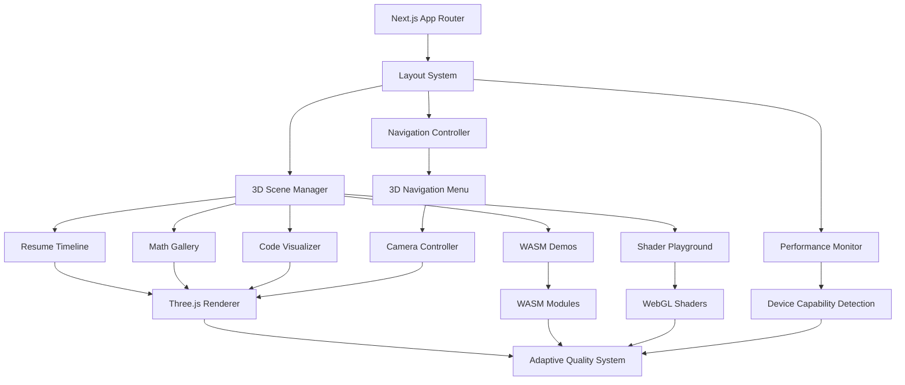
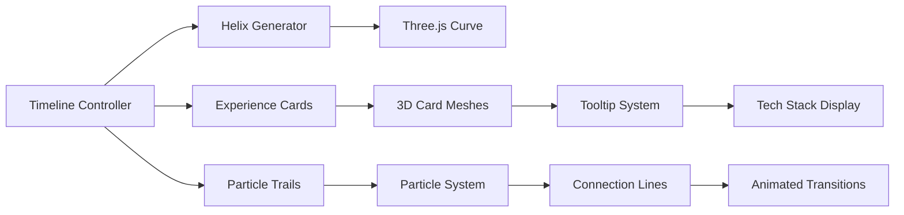

# Design Document

## Overview

The Interactive Portfolio Showcase transforms Manav Dhindsa's existing Next.js portfolio into a cutting-edge, immersive experience that demonstrates advanced web development capabilities while maintaining GitHub Pages hosting compatibility. The design leverages the existing Three.js and tsparticles foundation to create five distinct interactive sections that showcase 8+ years of software engineering experience through innovative 3D visualizations, mathematical art, and performance demonstrations.

The architecture prioritizes performance optimization, progressive enhancement, and size efficiency to ensure the entire application remains under GitHub Pages' 1GB limit while delivering a premium user experience across all device capabilities.

## Architecture

### High-Level System Architecture



### Core Technology Stack

**Frontend Framework:**
- Next.js 14+ with App Router for optimal static generation
- TypeScript for type safety and developer experience
- Tailwind CSS for efficient styling with minimal bundle impact

**3D Graphics & Visualization:**
- Three.js for 3D scene management and rendering
- React Three Fiber for React integration
- Custom WebGL shaders for advanced visual effects
- tsparticles for particle system management

**Performance & Optimization:**
- WebAssembly (WASM) modules for computationally intensive tasks
- Web Workers for background processing
- Progressive loading and code splitting
- Dynamic quality adjustment based on device capabilities

**Build & Deployment:**
- Static site generation for GitHub Pages compatibility
- Asset optimization and compression
- Bundle size monitoring and optimization

## Components and Interfaces

### 1. Scene Management System

**SceneManager Interface:**
```typescript
interface SceneManager {
  currentScene: SceneType
  transitionTo(scene: SceneType, options?: TransitionOptions): Promise<void>
  registerScene(scene: Scene3D): void
  dispose(): void
}

interface Scene3D {
  id: string
  initialize(): Promise<void>
  render(deltaTime: number): void
  resize(width: number, height: number): void
  cleanup(): void
}
```

**Key Components:**
- **BaseScene3D**: Abstract base class for all 3D scenes
- **SceneTransitionManager**: Handles smooth camera transitions between sections
- **AssetLoader**: Progressive loading system for 3D models and textures
- **PerformanceMonitor**: Real-time performance tracking and quality adjustment

### 2. 3D Interactive Resume Timeline

**Architecture:**


**Data Structure:**
```typescript
interface ExperienceData {
  id: string
  company: string
  position: string
  duration: DateRange
  location: string
  technologies: Technology[]
  projects: Project[]
  achievements: string[]
  position3D: Vector3
}

interface Technology {
  name: string
  category: TechCategory
  proficiency: number
  color: string
  icon?: string
}
```

**Key Features:**
- Helical timeline path using Three.js CatmullRomCurve3
- Floating 3D cards with glassmorphism effects
- Interactive particle trails connecting experiences
- Smooth camera interpolation between positions
- Responsive tooltip system with technology visualization

### 3. Mathematical Art Gallery

**Component Architecture:**
```typescript
interface MathVisualization {
  id: string
  name: string
  description: string
  initialize(canvas: HTMLCanvasElement): void
  update(deltaTime: number): void
  handleInteraction(event: InteractionEvent): void
}

class FourierVisualizer implements MathVisualization {
  private drawingPath: Vector2[]
  private fourierSeries: ComplexNumber[]
  private animationPhase: number
}

class FractalExplorer implements MathVisualization {
  private mandelbrotShader: WebGLShader
  private zoomLevel: number
  private centerPoint: ComplexNumber
}
```

**Visualization Components:**
- **Fourier Transform Visualizer**: Interactive drawing canvas with real-time sine wave decomposition
- **Fractal Explorer**: GPU-accelerated Mandelbrot/Julia set renderer with zoom controls
- **Algorithm Visualizer**: Particle-based sorting algorithm demonstrations
- **Neural Network Playground**: Interactive network topology with animated training

### 4. Code Architecture Visualizer

**Graph System:**
```typescript
interface CodeGraph {
  nodes: CodeNode[]
  edges: CodeEdge[]
  layout: GraphLayout
}

interface CodeNode {
  id: string
  type: NodeType
  name: string
  size: number
  dependencies: string[]
  position3D: Vector3
  metadata: NodeMetadata
}

enum NodeType {
  FILE = 'file',
  DIRECTORY = 'directory',
  FUNCTION = 'function',
  CLASS = 'class',
  MODULE = 'module'
}
```

**Visualization Types:**
- **Dependency Graph**: 3D network visualization of project dependencies
- **File Structure Tree**: Navigable 3D tree representation
- **Git Timeline**: Animated commit history visualization
- **Architecture Patterns**: Visual representation of microservices, serverless, and hybrid architectures

### 5. WASM Performance Demonstrations

**WASM Module Interface:**
```typescript
interface WASMModule {
  initialize(): Promise<void>
  process(input: ArrayBuffer): ArrayBuffer
  getMemoryUsage(): number
  dispose(): void
}

class ImageProcessor implements WASMModule {
  private wasmInstance: WebAssembly.Instance
  applyFilter(imageData: ImageData, filter: FilterType): ImageData
}
```

**Demo Components:**
- **Image Processing Suite**: Real-time filters (blur, edge detection, color manipulation)
- **Physics Simulation**: Simple particle systems and collision detection
- **Cryptographic Demos**: Hash visualization and basic encryption
- **Performance Comparison**: Side-by-side WASM vs JavaScript benchmarks

### 6. Shader Art Playground

**Shader Management:**
```typescript
interface ShaderProgram {
  vertexShader: string
  fragmentShader: string
  uniforms: ShaderUniforms
  compile(): WebGLProgram
  setUniforms(uniforms: Partial<ShaderUniforms>): void
}

interface ShaderUniforms {
  time: number
  resolution: Vector2
  mouse: Vector2
  [key: string]: any
}
```

**Interactive Experiences:**
- **Fluid Simulation**: Mouse-interactive fluid dynamics using fragment shaders
- **Raymarching Scenes**: 3D environments rendered entirely in shaders
- **Particle Effects**: GPU-accelerated particle systems
- **Procedural Generation**: Real-time terrain and texture generation

## Data Models

### Resume Data Model

```typescript
interface ResumeData {
  personal: PersonalInfo
  experience: Experience[]
  education: Education[]
  skills: SkillCategory[]
  projects: Project[]
}

interface Experience {
  id: string
  company: string
  position: string
  startDate: Date
  endDate: Date | null
  location: string
  description: string
  technologies: string[]
  achievements: Achievement[]
  projects: ProjectReference[]
}

interface SkillCategory {
  name: string
  skills: Skill[]
  color: string
  icon: string
}

interface Skill {
  name: string
  proficiency: number // 0-100
  yearsOfExperience: number
  projects: string[]
}
```

### 3D Scene Data Model

```typescript
interface Scene3DData {
  camera: CameraConfig
  lighting: LightingConfig
  objects: Object3DData[]
  animations: AnimationData[]
  interactions: InteractionData[]
}

interface Object3DData {
  id: string
  type: ObjectType
  geometry: GeometryData
  material: MaterialData
  position: Vector3
  rotation: Vector3
  scale: Vector3
}

interface AnimationData {
  target: string
  property: string
  keyframes: Keyframe[]
  duration: number
  easing: EasingFunction
}
```

### Performance Metrics Model

```typescript
interface PerformanceMetrics {
  fps: number
  memoryUsage: number
  renderTime: number
  deviceCapabilities: DeviceCapabilities
  qualityLevel: QualityLevel
}

interface DeviceCapabilities {
  webglVersion: number
  maxTextureSize: number
  maxVertexUniforms: number
  supportsWASM: boolean
  supportsWebWorkers: boolean
  isMobile: boolean
}

enum QualityLevel {
  LOW = 'low',
  MEDIUM = 'medium',
  HIGH = 'high',
  ULTRA = 'ultra'
}
```

## Error Handling

### Error Boundary System

```typescript
class Scene3DErrorBoundary extends React.Component {
  state = { hasError: false, fallbackMode: false }

  static getDerivedStateFromError(error: Error) {
    return { hasError: true, fallbackMode: true }
  }

  componentDidCatch(error: Error, errorInfo: ErrorInfo) {
    console.error('3D Scene Error:', error, errorInfo)
    // Fallback to 2D version
    this.setState({ fallbackMode: true })
  }
}
```

### Graceful Degradation Strategy

1. **WebGL Not Supported**: Fall back to CSS animations and 2D visualizations
2. **WASM Not Supported**: Use JavaScript implementations with performance warnings
3. **Low Memory Devices**: Reduce particle counts and texture resolutions
4. **Slow Network**: Progressive loading with skeleton screens
5. **Touch Devices**: Adapt interactions for touch input

### Error Recovery Mechanisms

- **Asset Loading Failures**: Retry with exponential backoff, fallback to placeholder assets
- **Shader Compilation Errors**: Fall back to simpler shaders or CSS effects
- **Memory Exhaustion**: Automatic quality reduction and garbage collection
- **Performance Issues**: Dynamic quality adjustment and feature disabling

## Testing Strategy

### Unit Testing
- **Component Testing**: React Testing Library for UI components
- **3D Scene Testing**: Mock Three.js objects and test scene logic
- **WASM Module Testing**: Test module interfaces and memory management
- **Utility Function Testing**: Mathematical calculations and data transformations

### Integration Testing
- **Scene Transitions**: Test smooth transitions between different sections
- **Performance Monitoring**: Verify quality adjustment mechanisms
- **Asset Loading**: Test progressive loading and error handling
- **Cross-browser Compatibility**: Ensure consistent behavior across browsers

### Performance Testing
- **Bundle Size Monitoring**: Automated checks for size regressions
- **Runtime Performance**: FPS monitoring and memory usage tracking
- **Load Testing**: Stress test with multiple concurrent animations
- **Mobile Performance**: Test on various mobile devices and network conditions

### Visual Regression Testing
- **Screenshot Comparison**: Automated visual testing for 3D scenes
- **Animation Testing**: Verify smooth transitions and effects
- **Responsive Design**: Test across different screen sizes and orientations

### Accessibility Testing
- **Keyboard Navigation**: Ensure all interactive elements are keyboard accessible
- **Screen Reader Compatibility**: Test with assistive technologies
- **Color Contrast**: Verify sufficient contrast ratios
- **Motion Sensitivity**: Provide options to reduce motion for sensitive users

## Size Optimization Strategy

### Asset Optimization
- **3D Models**: Use GLTF with Draco compression
- **Textures**: WebP format with multiple resolution levels
- **Shaders**: Minification and dead code elimination
- **WASM Modules**: Optimize Rust compilation flags for size

### Code Splitting Strategy
```typescript
// Lazy load heavy components
const ResumeTimeline = lazy(() => import('./components/ResumeTimeline'))
const MathGallery = lazy(() => import('./components/MathGallery'))
const CodeVisualizer = lazy(() => import('./components/CodeVisualizer'))
const WASMDemos = lazy(() => import('./components/WASMDemos'))
const ShaderPlayground = lazy(() => import('./components/ShaderPlayground'))
```

### Progressive Enhancement
- **Core Experience**: Essential functionality loads first
- **Enhanced Features**: Advanced visualizations load progressively
- **Fallback Systems**: 2D alternatives for 3D features
- **Optional Assets**: Load based on user interaction and device capabilities

### Bundle Analysis and Monitoring
- **Webpack Bundle Analyzer**: Regular analysis of bundle composition
- **Size Budgets**: Automated alerts for size threshold breaches
- **Tree Shaking**: Eliminate unused code from dependencies
- **Dynamic Imports**: Load features on demand

This design ensures a sophisticated, performant portfolio that showcases advanced technical capabilities while respecting GitHub Pages constraints and providing excellent user experience across all devices.